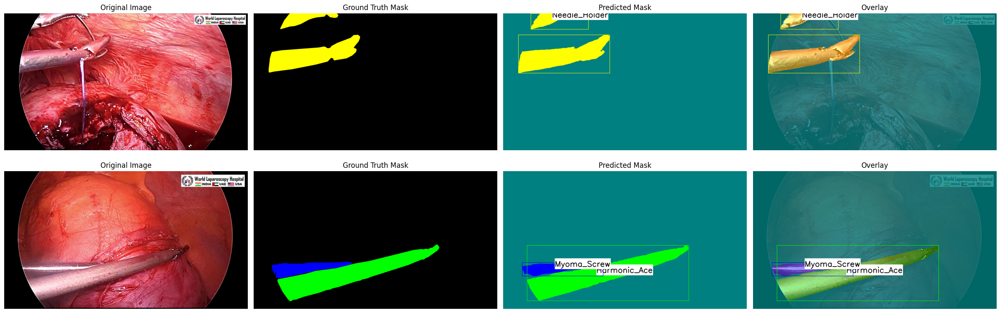

# Multi-SIS Semantic Segmentation by DeepLabv3+

This repository implements semantic segmentation of surgical instruments using **DeepLabv3+ (ResNet-101)**. Although trained as a semantic segmentation model, the output is post-processed to extract **bounding boxes** and **labels** — mimicking instance-level visualization. The goal is to robustly segment and identify surgical instruments in laparoscopic scenes using custom annotated data.

---

## 📌 Highlights

- ✅ **Semantic Segmentation** with [segmentation_models.pytorch](https://github.com/qubvel/segmentation_models.pytorch)
- ✅ COCO-format dataset with polygon masks
- ✅ Per-instance **bounding boxes** + **class labels**
- ✅ Adjustable **background overlay color** and **transparency**
- ✅ Quantitative metrics: **IoU**, **Precision**, **Recall**, **F1 Score** (per class)
- ✅ Lightweight and easy-to-run on Google Colab

---

## 📁 Dataset Structure

Your dataset should be organized as follows:

```
datasets/
├── surgical_instruments/
│   ├── images/
│   │   ├── train/
│   │   └── valid/
│   ├── annotations/
│   │   ├── instances_train.json
│   │   └── instances_valid.json
│   └── semantic_masks/
│       ├── train/
│       └── valid/
```

- **Masks** are semantic (one class ID per pixel).
- **COCO JSON** is used for polygon annotations (originally for instance segmentation training).

---

## 🏷️ Class Definitions

| ID | Class Name      |
|----|-----------------|
| 0  | Background      |
| 1  | Grasper         |
| 2  | Harmonic_Ace    |
| 3  | Myoma_Screw     |
| 4  | Needle_Holder   |
| 5  | Suction         |
| 6  | Trocar          |

---

## 🧠 Model Overview

- **Architecture**: DeepLabv3+  
- **Backbone**: ResNet-101  
- **Pretrained on**: ImageNet  
- **Input size**: 512×512  
- **Loss function**: Dice + Cross Entropy  
- **Training**: 25 epochs on ~2700 training images (Google Colab)

---

## 📊 Evaluation Results

### IoU per Class:
```
Background     : IoU = 0.9943
Grasper        : IoU = 0.7772
Harmonic_Ace   : IoU = 0.7662
Myoma_Screw    : IoU = 0.8263
Needle_Holder  : IoU = 0.7890
Suction        : IoU = 0.5736
Trocar         : IoU = 0.8359
```

### Precision / Recall / F1:
```
Background     : Precision = 0.9972, Recall = 0.9971, F1 = 0.9972
Grasper        : Precision = 0.8738, Recall = 0.8755, F1 = 0.8746
Harmonic_Ace   : Precision = 0.8227, Recall = 0.9178, F1 = 0.8676
Myoma_Screw    : Precision = 0.8907, Recall = 0.9196, F1 = 0.9049
Needle_Holder  : Precision = 0.8576, Recall = 0.9079, F1 = 0.8820
Suction        : Precision = 0.9122, Recall = 0.6071, F1 = 0.7290
Trocar         : Precision = 0.9303, Recall = 0.8917, F1 = 0.9106
```

---

## 🖼️ Visualization

The model output is visualized with:

- **Color-coded masks**
- **Bounding boxes** per object (even with semantic segmentation)
- **Class name labels**
- **Adjustable background color and transparency**

📌 Example:



---

## 🚀 Inference Usage

```python
visualize_predictions_with_boxes_bg(
    model=model,
    device=torch.device("cuda:0"),
    images_dir="datasets/surgical_instruments/images/valid",
    masks_dir="datasets/surgical_instruments/semantic_masks/valid",
    num_images=10,
)
```

---

## ⚙️ Requirements

```bash
!pip install segmentation-models-pytorch albumentations
```

---

## 📄 License

This project is intended for **academic research and educational use** only. Please cite appropriately if used in publications.

---

## 🤝 Acknowledgements

- Based on real-world surgical datasets from YouTube videos
- DeepLabv3+ powered by `segmentation_models.pytorch`
- Overlay-style visualization inspired by Instance Segmentation Models
